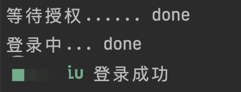
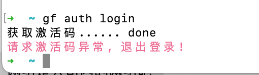
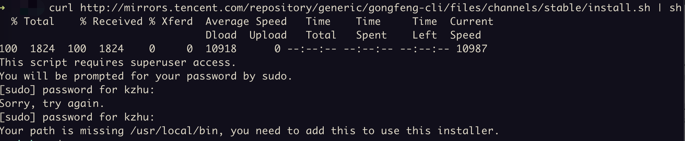
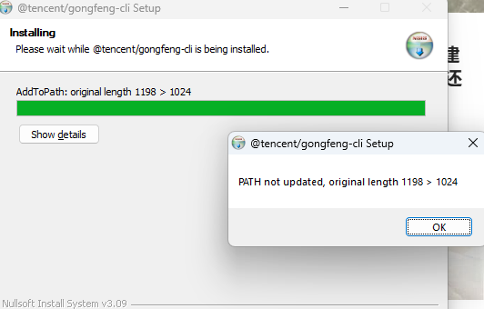

# 项目介绍

## 工蜂 CLI

工蜂 CLI 是工蜂的命令行界面，使您无需打开浏览器即可在命令行下完成创建合并请求等工蜂常见操作。

# 快速上手

## 安装工蜂 CLI

### 通过脚本安装

安装包包含运行时 node.js, 不需要在本机安装 node.js。

下面脚本需要 sudo 权限，仅限于 mac & linux 使用。

```shell
curl -L http://mirrors.tencent.com/repository/generic/gongfeng-cli/files/channels/stable/install.sh | sh
```

> 工蜂 CLI 默认使用 `gf` 命令, 会和 **zsh** 的 `gf` 命令冲突。如果有冲突，使用前请先执行 `echo "unalias gf" >> ~/.zshrc`。执行后运行`source ~/.zshrc`或者重启命令行

### 下载安装包安装

下载相应平台的安装包安装。

| 平台           | 下载链接                                                                                       |
| -------------- | ---------------------------------------------------------------------------------------------- |
| macOS m1       | https://mirrors.tencent.com/repository/generic/gongfeng-cli/files/channels/stable/gf-arm64.pkg |
| macOS          | https://mirrors.tencent.com/repository/generic/gongfeng-cli/files/channels/stable/gf-x64.pkg   |
| windows 64-bit | https://mirrors.tencent.com/repository/generic/gongfeng-cli/files/channels/stable/gf-x64.exe   |
| windows 32-bit | https://mirrors.tencent.com/repository/generic/gongfeng-cli/files/channels/stable/gf-x86.exe   |

> mac 安装包请右键打开，双击打开会提示不允许打开。

> 工蜂 CLI 默认使用 `gf` 命令, 会和 **zsh** 的 `gf` 命令冲突。如果有冲突，使用前请先执行 `echo "unalias gf" >> ~/.zshrc`。执行后运行`source ~/.zshrc`或者重启命令行

### 通过 npm 安装

工蜂 CLI 是使用 `Node.js` 构建的，所以可以通过 `npm` 来安装。如果在工蜂 CLI 热更新有问题的情况下，可以使用这种手动安装方式。
这种方式安装的前提是必须先安装 `Node` 和 `npm`。

npm 安装需设置公司镜像源 `npm config set registry https://mirrors.tencent.com/npm/`

> 如果可以，建议通过安装包安装工蜂 CLI。
>
> 这种安装方式不能够使用更新功能。同时需要使用您机器自带的 `Node.js`, 自带的 `Node.js` 的版本可能低于工蜂 CLI 需要运行的版本。
>
> 如果使用安装包的方式安装工蜂 CLI，工蜂 CLI 会自带一个合适版本的 `Node.js`，这和您机器自带的 `Node.js` 并不会有任何冲突。

```shell
npm install -g @tencent/gongfeng-cli
```

## 验证安装

验证是否成功安装工蜂 CLI, 可以使用 `gf --version` 命令。

```shell
gf --version
@tencent/gongfeng-cli/0.5.0-beta.0 darwin-x64 node-v17.8.0
```

输出的结果看起来会是`@tencent/gongfeng-cli/x.y.z`这种形式。

## 开始使用工蜂 CLI

执行`gf --help`了解工蜂 CLI 支持的所有命令，执行`gf <command> --help`获取指定命令的帮助。

在安装工蜂 CLI 后，首先需要执行 `gf auth login`（别名: `gf login`）命令登录工蜂。

### 通过授权码登录工蜂

1. 执行`gf login`

2. 复制授权码

   

3. 验证授权码

   

4. 确认授权

   

5. 登录成功

   

### [在命令行下管理合并请求](https://git.woa.com/code/cli/tree/master/packages/mr)

创建合并请求

```shell
# 创建合并请求
gf mr create
# 快速发起合并请求，所有字段使用默认值
gf mr create -q
# 打开浏览器创建合并请求
gf mr create -w
```

查看仓库下所有合并请求

```shell
gf mr list
```

检出一个合并请求到本地

```shell
gf mr checkout
```

## 热更新

工蜂 CLI 会自动热更新到最新版本，除非是通过 `npm` 方式安装的。

当执行 `gf` 命令时，一个后台进程会检测工蜂 CLI 的最新版本。如果发现了新版本，会把新版本更新包下载到 `~/.local/share/gf/client`目录。
这个后台进程最多每 4 小时进行一次。

## 工蜂 CLI 架构

工蜂 CLI 是基于开源 CLI 框架 [oclif](https://oclif.io/) 开发而来。oclif 可作为任何开发人员构建大型或小 CLI 的框架。
该框架包括 CLI 生成器，自动化文档创建和测试框架。 基于 oclif 可以开发工蜂 CLI 的插件。

## 工蜂 CLI 插件开发

参考[插件开发文档](./docs/plugins.md)

# 常见问题

## 疑难杂症

如果使用工蜂 CLI 有问题，先确认是否已经安装了最新版本的工蜂 CLI。 如果不是最新版本，使用 `gf update` 更新到最新版本。

> 不是所有的安装都支持 `gf update`
>
> 如果是通过 `npm` 或者 `yarn` 安装的工蜂 CLI，
> 必须通过 `npm upgrade -g @tencent/gongfeng-cli` 或者 `yarn global upgrade @tencent/gongfeng-cli` 升级到最新版本。

如果更新失败了，可以先卸载工蜂 CLI，再重新安装一次。

如果还有问题，可以在执行命令的时候设置调试环境变量 `DEBUG=*` 打印出详细信息来排查问题所在。

```shell
DEBUG=* gf update
```

同时也可以查看工蜂 CLI 的错误日志，保存在以下目录。

| 操作系统 | 日志目录                                                    |
| -------- | ----------------------------------------------------------- |
| macOS    | ~/Library/Caches/gf                                         |
| Windows  | %LOCALAPPDATA%/gf (C:\Users\Administrator\AppData\Local\gf) |

### 工蜂 IDE 通过 npm 安装工蜂 CLI

工蜂 IDE 通过 npm 安装工蜂 CLI 时会报没权限异常：

```shell
npm ERR! code 127
npm ERR! path /root/.nvm/versions/node/v17.8.0/lib/node_modules/@tencent/gongfeng-cli/node_modules/@tencent/code-dugite
npm ERR! command failed
npm ERR! command sh -c node ./script/download-git.js
npm ERR! sh: 1: node: Permission denied
```

1. `nvm install v17.8.0` 切换到 工蜂 CLI 使用的版本
2. `npm root -g` 获取全局 npm package 安装目录

```shell
root: npm root -g
/root/.nvm/versions/node/v17.8.0/lib/node_modules
```

3. `chown -R root:root /root/.nvm/versions/node/v17.8.0/lib/node_modules`
4. `npm install -g @tencent/gongfeng-cli`

### 使用系统 Git

工蜂 CLI 在 windows 和 macos 平台会携带 Git 执行程序，如果不想使用工蜂 CLI 自带的 Git，可以通过以下配置设置为系统 Git

1. 设置 `LOCAL_GIT_DIRECTORY` 环境变量， 通过执行命令 `which git` 获取 `LOCAL_GIT_DIRECTORY` 变量值, 变量是 `which git` 获取目录的上两层目录如下：
   `/usr/local/bin/git` => `/usr/local`

```shell
export LOCAL_GIT_DIRECTORY=/usr/local
```

2. 设置 `GIT_EXEC_PATH` 环境变量，通过执行命令 `git --exec-path` 获取 `GIT_EXEC_PATH` 变量值

```shell
export GIT_EXEC_PATH=/usr/local/libexec/git-core
```

### 登录失败



检查是否配置了代理，如果配置代理，去掉代理重试。

### 安装提示没有 `/usr/local/bin` 目录



当前系统登录用户切成 root 用户重新安装。

### windows 安装报 `PATH not updated, original length...`



oclif 使用的 NSIS 打包，对 PATH 会有检测，如果超过 1024 个字符则不会添加到 PATH中。解决方案有两种：

1. 删除 PATH 中不在需要使用的路径，卸载工蜂 CLI 后重新安装。
2. 手动在 Windows 的 PATH 中添加工蜂 CLI 的安装目录（如：C:Program Files\gf\bin）。

## 卸载工蜂 CLI

> 同时也会删除所有已经下载的工蜂 CLI 插件

### macOS

在 mac 上，可以执行以下命令

```shell
sudo rm -rf /usr/local/gf /usr/local/lib/gf /usr/local/bin/gf ~/.local/share/gf ~/Library/Caches/gf
```

### Windows

在 Windows 上下载工蜂 CLI：

1. 点击 **开始** > **控制面板** > **程序** > **程序和功能**
2. 选择 **@tencent/gongfeng-cli**，点击 **卸载**

# 行为准则

合入代码需符合腾讯代码安全开发准则

# 如何加入

有意愿想参与共建的同学，可以按以下方式参与共建

1. fork 此项目
2. 开发 CLI 功能
3. 提交合并请求
4. 等待评审合并请求通过
5. 合入 工蜂 CLI

或联系**工蜂助手**成为此项目开发者

# 团队介绍

暂无
