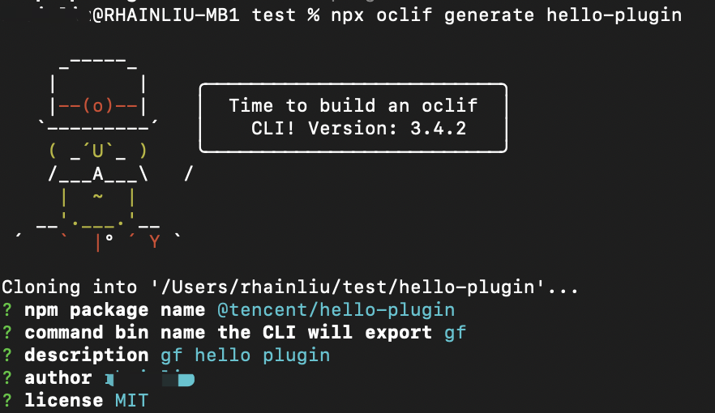
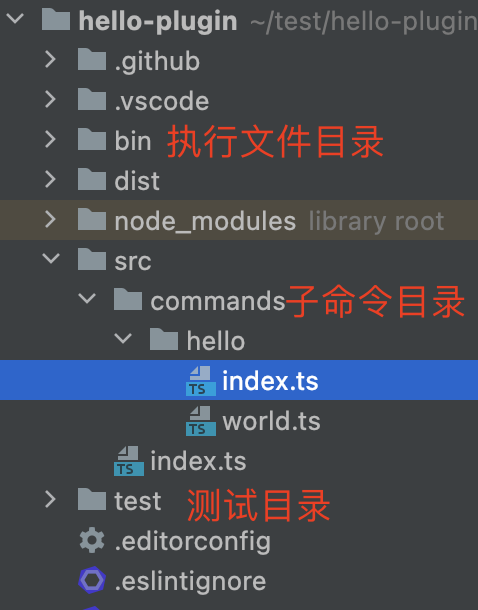

# 工蜂插件开发指南

工蜂 CLI 基于的 [oclif](https://oclif.io/) 自身具有插件开发功能。用户可以使用 `gf plugins:install PLUGINNAME`
安装插件。插件开发者也可以通过 `gf plugins:link` 连接本地插件。

下面演示创建一个简单的`hello world`插件。

## 生成工蜂插件项目

1. 执行下面的命令：

```shell
npx oclif generate hello-plugin
```



2. 在 `hello-plugin` 将会生成 CLI 插件文件。目录格式如下



3. `commands` 目录将会是插件子命令的开发所在目录，其中一个文件或者一个目录将会生成一个子命令。
   如上图将会生成 `gf hello` 和 `gf hello world` 两个子命令

4. 开发子命令功能

5. 插件项目提交到工蜂

> 需要插件项目 build 之后的 dist 目录文件也提交到工蜂

6. 发布到 https://mirrors.tencent.com/ 上（可选）

## 安装工蜂插件

1 安装

- 指定工蜂插件项目链接安装

```shell
gf plugins:install https://git.woa.com/code/hello-plugin.git
```

- 指定 npm 包名安装

```shell
gf plugins:install @tencent/hello-plugin
```

- 使用 `gf plugins:link` 安装本地插件。

```shell
cd hello-plugin
gf plugins:link
```

2. 安装成功后，执行插件子命令

`gf hello jack --from cli`

结果：

```shell
hello jack from cli! (./src/commands/hello/index.ts)
```

`gf hello world`

结果：

```shell
hello world! (./src/commands/hello/world.ts)
```

可以看到成功的为 CLI 新增了 `hello` 和 `hello world` 两个命令。

## 卸载插件

```shell
gf plugins:uninstall @tencent/hello-plugin
```
